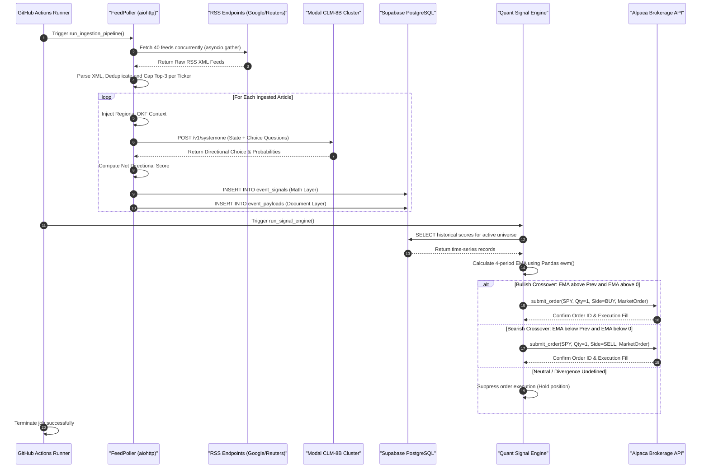
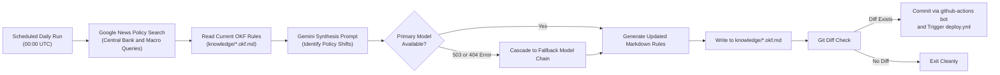

# End-to-End System Architecture and Technical Workflow

## 1. Executive Summary & Architectural Philosophy

The **Global Sentiment Platform of Share Markets (GSP)** is an autonomous, production-grade quantitative intelligence and execution platform. The system continuously digests unstructured global macroeconomic news streams across 20 international asset classes in 4 geopolitical regions (United States, India, United Kingdom, and Japan), evaluates deterministic market sentiment using Contrastive Language Models (**CLM-8B System-One**), stores vertically partitioned time-series signals in PostgreSQL, computes multi-period Exponential Moving Average (**EMA**) momentum indicators, executes automated paper trades via Alpaca's REST API, and renders low-latency telemetry to an institutional Streamlit terminal.

```
+---------------------------------------------------------------------------------------------------------+
|                                    GSP CORE ARCHITECTURAL PARADIGMS                                     |
+------------------------------------+------------------------------------+-------------------------------+
|       SYSTEM-ONE INFERENCE         |       VERTICAL PARTITIONING        |      GITOPS FOR KNOWLEDGE     |
| Contrastive state-action mapping   | Decoupling math & document layers  | Macro heuristics versioned    |
| yields sub-60ms inference latency  | reduces query load by >90% while   | in Markdown; auto-evolved by  |
| with zero cold-boot overhead.      | preserving rich raw contexts.      | Google Gemini cron jobs.      |
+------------------------------------+------------------------------------+-------------------------------+
```

### Core Design Principles

1. **Deterministic System-One Decision Making:** Unlike traditional autoregressive large language models that generate verbose text and suffer from high latency and non-deterministic formatting errors, GSP deploys **CLM-8B** hosted on serverless GPU infrastructure. CLM utilizes contrastive learning (InfoNCE) over a frozen Qwen3-8B embedding backbone with lightweight 20M-parameter projection heads to directly score directional action candidates (`Bullish`, `Bearish`, `Neutral`) with mathematical probability vectors.
2. **Strict Vertical Partitioning:** The database tier separates high-frequency numerical time-series queries from heavy unstructured document storage. Analytical aggregation queries scan only the lightweight `event_signals` table (leveraging composite B-Tree and BRIN indices), completely bypassing heavy text and JSON blobs located in `event_payloads`.
3. **GitOps-Driven Knowledge Evolution:** Macroeconomic policy regimes change dynamically. Instead of baking heuristics into model prompts or hardcoding them in Python logic, rules reside in standalone Objective Knowledge Framework (`*.okf.md`) files. An autonomous crawler powered by Google Gemini analyzes global central bank shifts daily, updating these files via automated Git commits without requiring software redeployments.
4. **Decoupled Serverless Topologies:** Ingestion, AI inference, relational storage, quantitative trade execution, and user presentation execute across independently scalable, fault-isolated serverless environments: GitHub Actions runners, Modal serverless GPU containers, Supabase managed PostgreSQL, and Streamlit Community Cloud.

---

## 2. High-Level Architecture Overview

The system operates across seven distinct architectural tiers, executing automated pipelines on scheduled cadences (every 2 hours for ingestion/signals, daily for knowledge updates) alongside continuous real-time presentation.


### End-to-End Execution Sequence

The following sequence diagram outlines the chronological interaction flow during a scheduled 2-hour pipeline run:



---

## 3. Layer-by-Layer Technical Breakdown

### Layer 1: Ingestion Layer
* **Source Files:** [`src/ingestion/poller.py`](file:///d:/Dev/repos/gsp/src/ingestion/poller.py), [`src/ingestion/api_clients.py`](file:///d:/Dev/repos/gsp/src/ingestion/api_clients.py)
* **Runtime & Dependencies:** Python 3.10+, `aiohttp>=3.11.12`, `xml.etree.ElementTree`, `asyncio`

#### 1. Coverage Universe & Declarative Market Registry (`market_registry.json`)
The ingestion layer is driven entirely by a single-source-of-truth declarative registry at [`src/config/market_registry.json`](file:///d:/Dev/repos/gsp/src/config/market_registry.json). Adding a new country to the global coverage universe requires solely appending an entry to the registry without modifying core ingestion code. Currently, it maintains active coverage across 20 global macroeconomic indices and proxies:

| Region Code | Market Region | Currency | Geotargeting (`hl`, `gl`, `ceid`) | Tracked Indices / Proxies |
| :--- | :--- | :--- | :--- | :--- |
| **US** | United States | USD | `en-US`, `US`, `US:en` | S&P 500, NASDAQ, Dow Jones, Russell 2000, VIX |
| **IN** | India | INR | `en-IN`, `IN`, `IN:en` | Nifty 50, Sensex, Nifty Bank, Nifty IT, BSE Midcap |
| **UK** | United Kingdom | GBP | `en-GB`, `GB`, `GB:en` | FTSE 100, FTSE 250, FTSE All-Share, FTSE AIM, UK Gilts |
| **JP** | Japan | JPY | `en-JP`, `JP`, `JP:en` | Nikkei 225, TOPIX, JP Mothers (TSE Growth), JASDAQ, JP Bonds |

#### 2. Geotargeted Query Channeling & Polling Architecture
Each asset is dynamically expanded by [`src/config/market_registry.py`](file:///d:/Dev/repos/gsp/src/config/market_registry.py) into two distinct geotargeted polling channels:
1. **Geotargeted General News Channel:** `https://news.google.com/rss/search?q=%22{ticker}%22+market&hl={hl}&gl={gl}&ceid={ceid}`
2. **Geotargeted Institutional Reuters Channel:** `https://news.google.com/rss/search?q=%22{ticker}%22+market+site:reuters.com&hl={hl}&gl={gl}&ceid={ceid}`

Exact quotation prevents Google from returning broad fuzzy keyword associations, while country geolocation parameters (`gl`, `ceid`) force the RSS indexer to return country-edition articles rather than defaulting to US-centric cloud runner editions. `FeedPoller` executes all 40 active endpoints asynchronously using `asyncio.gather(*tasks)` and a shared `aiohttp.ClientSession`.

#### 3. Deterministic Entity & Regional Affinity Gatekeeper (`classifier.py`)
To mathematically prevent cross-region contamination (e.g., US Wall Street market wraps erroneously tagged under India, or Indian shares returned under UK FTSE queries), [`RegionalAffinityClassifier`](file:///d:/Dev/repos/gsp/src/ingestion/classifier.py) evaluates every parsed headline against a compiled regex entity trie:
* **Ticker Affinity (Weight = 3.0):** Matches exact index ticker names and their aliases.
* **Macroeconomic Anchor Affinity (Weight = 1.0):** Matches country-specific institutions, central banks, and currency anchors (`rbi`, `rupee`, `dalal street`, `fed`, `boe`, `boj`, `yen`, `gilt`).
* **Verification Rule:** An item is only accepted into the pipeline if $\text{Affinity}(\text{ExpectedRegion}) > 0$. Cross-region contaminants where expected affinity is 0 but another region's affinity is high are automatically rejected and logged. Non-financial news (0 affinity across all regions) is dropped.

#### 4. XML Parsing, Rate Control & Deduplication Logic
* **Lightweight Parsing:** Rather than incurring the overhead of heavy third-party RSS libraries, [`RSSClient.parse_feed`](file:///d:/Dev/repos/gsp/src/ingestion/api_clients.py#L24-L54) uses Python's built-in `xml.etree.ElementTree` to parse raw XML into standard Python dictionaries containing title, link, published timestamp, and summary.
* **Volume Limiting & Free-Tier Guard:** The parser applies a strict `items[:3]` slice per endpoint. Across 40 feeds, this generates a deterministic ceiling of at most 120 items per ingestion cycle, ensuring the downstream inference process stays well within API quotas and completes within standard CI/CD timeouts.
* **Normalized Data Contract:**
```json
{
  "source_system": "RSS_POLLER",
  "content_type": "news",
  "region_tag": "US",
  "index_ticker": "S&P 500",
  "data": {
    "headline": "Fed signals potential pause as inflation data moderates",
    "summary": "U.S. stocks edged higher following comments by Federal Reserve officials...",
    "url": "https://news.google.com/rss/articles/...",
    "timestamp": "Wed, 02 Oct 2026 12:00:00 GMT"
  }
}
```

#### 3. Universal Multi-Stage News Deduplication Engine
To eliminate OPEX/CAPEX waste (redundant inference costs and duplicate database records), [`src/ingestion/dedup.py`](file:///d:/Dev/repos/gsp/src/ingestion/dedup.py) provides deterministic headline fingerprinting (`canonical_fingerprint()`):
* **Intra-Run Deduplication:** In [`src/ingestion/poller.py`](file:///d:/Dev/repos/gsp/src/ingestion/poller.py#L77-L85), [`NewsDeduplicator`](file:///d:/Dev/repos/gsp/src/ingestion/dedup.py#L48-L82) filters the batch of polled items across all 20 ticker queries. If major publishers (Reuters, Bloomberg, etc.) appear in multiple feeds (e.g. Nifty 50 and Sensex), redundant copies are collapsed into a single canonical payload.
* **Cross-Run Database Deduplication:** In [`src/main.py`](file:///d:/Dev/repos/gsp/src/main.py#L140-L175), before calling the AI engine, the pipeline queries recent headline fingerprints from Supabase for the last 48 hours. Any headline already present in storage is skipped, saving 100% of redundant inference calls.

---

### Layer 2: AI Inference & Knowledge Layer
* **Source Files:** [`src/main.py`](file:///d:/Dev/repos/gsp/src/main.py), [`src/ai_engine/modal_app.py`](file:///d:/Dev/repos/gsp/src/ai_engine/modal_app.py), [`knowledge/*.okf.md`](file:///d:/Dev/repos/gsp/knowledge/)
* **Runtime & Dependencies:** Modal Cloud (NVIDIA A10G), `vllm`, `contrastive-lm`, `typesafe-sdk>=0.7.2`, `torch`, `hf_transfer`

#### 1. System-One CLM-8B Inference Architecture
Conventional generative AI models (System-Two) rely on autoregressive token-by-token generation, requiring hundreds of milliseconds to produce formatted JSON responses that frequently fail schema validation. GSP implements a **System-One Contrastive Language Model (CLM-8B)**:
* **Backbone:** Frozen `Qwen/Qwen3-8B` language model acting as a semantic text encoder.
* **Projection Heads:** Lightweight 20M-parameter contrastive heads (`Contrastive-LM/CLM-v0.1-8B`) trained via bidirectional InfoNCE loss.
* **Disaggregated Embeddings:** State text (the news headline + regional macro context) and action candidates (`Bullish`, `Bearish`, `Neutral`) are embedded separately. Candidate vectors are cached in an in-memory vector arena on the GPU, reducing repeated scoring operations to simple matrix dot products ($s_i^\top a_j / \tau$) and softmax operations, yielding latencies under 60 milliseconds.

#### 2. Grounded Contrastive Criteria & Polarity Anchoring
To prevent the inherent lexical positive bias of unconditioned language model embeddings (where financial words naturally associate with positive expansion terminology), [`src/main.py`](file:///d:/Dev/repos/gsp/src/main.py#L14-L21) explicitly grounds the contrastive hypotheses in concrete equity market outcomes:
* **Bullish Anchor:** *"Positive for equity markets: stock prices rising, benchmark index gains, market rally, interest rate cuts, economic expansion, capital inflows, corporate earnings beats."*
* **Bearish Anchor:** *"Negative for equity markets: stock prices falling, benchmark index drops, worst monthly or weekly decline, interest rate hikes, capital outflows, market selloffs, recession fears, margin compression."*
* **Neutral Anchor:** *"Balanced, flat, routine macroeconomic data, unchanged policy rates, or negligible directional market impact."*

This anchors the hypersphere projection so that severe drops, rate hikes, or outflows ("worst month since March") decisively project into negative conviction ($P(\text{Bearish}) \ge 0.85$).

#### 3. Serverless Modal Deployment & Zero Cold-Boot ASGI Design
To avoid connection proxy deadlocks and minimize cold-start latency, [`src/ai_engine/modal_app.py`](file:///d:/Dev/repos/gsp/src/ai_engine/modal_app.py) deploys the model directly to an NVIDIA A10G GPU using Modal's `@modal.asgi_app()` decorator:

```python
app = modal.App("clm-macro-engine")

@app.function(
    gpu="A10G", 
    image=image, 
    min_containers=0,
    scaledown_window=120,
    timeout=3600
)
@modal.asgi_app()
def clm_server():
    # 1. Spawn local vLLM pooling instance on port 8090
    vllm_process = subprocess.Popen([
        "vllm", "serve", "Qwen/Qwen3-8B", 
        "--served-model-name", "qwen3-8b", 
        "--runner", "pooling", 
        "--max-model-len", "2048", 
        "--port", "8090",
        "--enforce-eager", "--gpu-memory-utilization", "0.9"
    ])
    # 2. Wait for local health check endpoint
    # 3. Mount contrastive Engine and FastAPI app natively
    return fastapi_app
```

* **Image Optimization:** Weights are pre-baked into the Modal Debian container image using `hf_transfer` and Hugging Face snapshot downloads, eliminating runtime downloading delays.
* **Keep-Alive Scale-Down Window:** An idle scale-down window of 120 seconds keeps containers warm during consecutive batch queries.

#### 4. Mathematical Sentiment Calibration
In [`src/main.py`](file:///d:/Dev/repos/gsp/src/main.py#L22-L82), the TypeSafe SDK queries the CLM serverless endpoint. The probabilities $P(\text{Bullish})$, $P(\text{Bearish})$, and $P(\text{Neutral})$ are converted into a calibrated directional sentiment score $S \in [-1.0, 1.0]$:

1. **Relative Directional Spread ($s_{\text{rel}}$):**
   $$s_{\text{rel}} = \frac{P(\text{Bullish}) - P(\text{Bearish})}{P(\text{Bullish}) + P(\text{Bearish}) + \epsilon} \quad \text{where } \epsilon = 10^{-5}$$
2. **Neutrality Attenuation ($M$):**
   $$M = |s_{\text{rel}}| \times \left(1.0 - 0.5 \times P(\text{Neutral})\right)$$
3. **Directional Assignment & Clamping:**
   $$S = \begin{cases} 
      0.0 & \text{if Decision} = \text{Neutral or } |s_{\text{rel}}| < 0.05 \\
      -M & \text{if } P(\text{Bearish}) > P(\text{Bullish}) \\
      +M & \text{if } P(\text{Bullish}) > P(\text{Bearish})
   \end{cases}, \quad S = \max(-1.0, \min(1.0, S))$$

This ensures high confidence is required to trigger strong bullish or bearish values, while ambiguous headlines naturally decay toward zero.

#### 5. Objective Knowledge Framework (OKF) Integration
Prior to sending headlines to the AI model, [`src/main.py`](file:///d:/Dev/repos/gsp/src/main.py) dynamically loads the corresponding region's macro rules from `knowledge/{region}_macro.okf.md`. These rules provide the macroeconomic domain constraints under which the CLM evaluates headline impact (e.g., treating rate hikes as bearish for equities but bullish for currency values).

---

### Layer 3: Database & Storage Layer
* **Source Files:** [`src/database/client.py`](file:///d:/Dev/repos/gsp/src/database/client.py), [`src/database/schemas.sql`](file:///d:/Dev/repos/gsp/src/database/schemas.sql)
* **Runtime & Dependencies:** Supabase Managed PostgreSQL 15+, `psycopg2-binary>=2.9.10`, PgBouncer connection pooler

#### 1. Vertical Partitioning Schema Architecture
To optimize analytical query performance, the storage layer implements a two-table vertical partitioning pattern:

```sql
-- 1. The Math Layer (Ultra-lean for rapid vector aggregations)
CREATE TABLE event_signals (
    id UUID PRIMARY KEY DEFAULT uuid_generate_v4(),
    index_ticker VARCHAR(50) NOT NULL,
    market_region VARCHAR(100) NOT NULL,
    timestamp TIMESTAMPTZ NOT NULL,
    sentiment_score NUMERIC
);

-- 2. The Document Layer (Heavy unstructured payloads in 1-to-1 relationship)
CREATE TABLE event_payloads (
    id UUID PRIMARY KEY REFERENCES event_signals(id) ON DELETE CASCADE,
    raw_text TEXT,
    applied_okf_rules TEXT[],
    metadata JSONB
);
```

```
+------------------------------------------------------------------------------------+
|                                VERTICAL PARTITIONING                               |
+-----------------------------------------+------------------------------------------+
|      TABLE: event_signals (Math)        |      TABLE: event_payloads (Document)    |
+-----------------------------------------+------------------------------------------+
|  id: UUID (PK)                          |  id: UUID (PK, FK -> event_signals)      |
|  index_ticker: VARCHAR(50)              |  raw_text: TEXT                          |
|  market_region: VARCHAR(100)            |  applied_okf_rules: TEXT[]               |
|  timestamp: TIMESTAMPTZ                 |  metadata: JSONB                         |
|  sentiment_score: NUMERIC               |                                          |
+-----------------------------------------+------------------------------------------+
|  Scan Speed: Sub-millisecond            |  Access: Only fetched for drill-down     |
|  Used By: Signal Engine, EMA Charts     |  Used By: Live Intelligence Feed modal   |
+-----------------------------------------+------------------------------------------+
```

#### 2. Advanced Indexing Strategy
* **Composite B-Tree Index:**
  ```sql
  CREATE INDEX idx_event_signals_ticker_time 
  ON event_signals USING btree (index_ticker, timestamp DESC);
  ```
  Accelerates ticker-filtered chronological queries required by the quant engine and dashboard timeline.
* **Block Range Index (BRIN):**
  ```sql
  CREATE INDEX idx_event_signals_timestamp_brin 
  ON event_signals USING brin (timestamp);
  ```
  Since event records are written chronologically, BRIN stores only the minimum and maximum timestamps per physical disk block. This provides lightning-fast range queries over millions of historical events with less than 1% of the disk footprint of a traditional B-Tree index.

#### 3. Connection Pooling Logic
[`SupabasePoolClient`](file:///d:/Dev/repos/gsp/src/database/client.py#L9-L48) implements a thread-safe connection pool using `psycopg2.pool.ThreadedConnectionPool`. It is configured to route connections through Supabase's transaction-mode connection pooler (port 6543 / PgBouncer), preventing database connection exhaustion during bursts of concurrent runner requests.

---

### Layer 4: Signal & Quantitative Execution Engine
* **Source Files:** [`src/signal_engine/ema.py`](file:///d:/Dev/repos/gsp/src/signal_engine/ema.py), [`src/signal_engine/cron_jobs.py`](file:///d:/Dev/repos/gsp/src/signal_engine/cron_jobs.py)
* **Runtime & Dependencies:** Python 3.10+, `pandas>=2.2.3`, `alpaca-py>=0.40.0`

#### 1. Vectorized Exponential Moving Average (EMA) Calculation
[`calculate_ema`](file:///d:/Dev/repos/gsp/src/signal_engine/ema.py#L3-L26) operates on chronological sentiment time series using Pandas' vectorized `ewm` functionality:

$$\text{EMA}_t = \alpha \cdot S_t + (1 - \alpha) \cdot \text{EMA}_{t-1}, \quad \alpha = \frac{2}{N + 1}$$

With window size $N = 4$, the smoothing coefficient is $\alpha = 0.40$. `adjust=False` is enforced to apply the recursive exponential decay formula without introducing initialization bias.

```python
def calculate_ema(sentiment_data: pd.DataFrame, window: int = 4, column: str = 'sentiment_score') -> pd.Series:
    if column not in sentiment_data.columns:
        raise ValueError(f"DataFrame must contain a '{column}' column")
    return sentiment_data[column].ewm(span=window, adjust=False).mean()
```

#### 2. Crossover Strategy & Order Execution
The quantitative engine evaluates consecutive EMA points ($\text{EMA}_{\text{current}}$ and $\text{EMA}_{\text{previous}}$) to identify directional momentum shifts:

```
                  EMA > Prev & EMA > 0
               +------------------------> BUY (OrderSide.BUY)
               |
SIGNAL STATE --+  EMA < Prev & EMA < 0
               +------------------------> SELL (OrderSide.SELL)
               |
               +------------------------> HOLD (No Order Executed)
```

Orders are dispatched using Alpaca's modern Python SDK (`alpaca-py`) configured in paper-trading mode:

```python
order_data = MarketOrderRequest(
    symbol="SPY",
    qty=1.0,
    side=side,
    time_in_force=TimeInForce.GTC
)
trading_client = TradingClient(ALPACA_API_KEY, ALPACA_SECRET_KEY, paper=True)
order = trading_client.submit_order(order_data=order_data)
```

---

### Layer 5: Presentation & Dashboard Terminal
* **Source File:** [`src/ui/app.py`](file:///d:/Dev/repos/gsp/src/ui/app.py)
* **Runtime & Dependencies:** Streamlit Community Cloud, `streamlit>=1.30.0`, `plotly>=5.18.0`, `pandas>=2.2.3`

```
+------------------------------------------------------------------------------------+
|         GLOBAL SENTIMENT PLATFORM OF SHARE MARKETS (GSP) - TERMINAL LAYOUT         |
+------------------------------------------------------------------------------------+
|  [HEADER BANNER: System Status Online | GSP Platform Identity]                     |
+------------------------------------------------------------------------------------+
|  [THE QUANTITATIVE EDGE: Full-Width Contrastive Language Model (CLM) USP Banner]   |
+------------------------------------------------------------------------------------+
|  [5-COLUMN FILTER BAR: Timeframe | Region | Timezone | EMA Window | Chart Display] |
+--------------------------+---------------------------------------------------------+
|  KPI TILES (LEFT COL)    |  CHART & TILES (RIGHT COL)                              |
|  - Aggregate Optimism    |  +---------------------------------------------------+  |
|  - Market Bias (Bull/Bear|  | Plotly Area Chart (Multi-Index Overlay + EMA Trend) |  |
|  - Total Ingested Volume |  +---------------------------------------------------+  |
|  - Active Universe Count |  - Mini Asset Tiles (S&P, NASDAQ, Dow, Russell, VIX)    |
+--------------------------+---------------------------------------------------------+
|  LIVE INTELLIGENCE STREAM (COLLAPSIBLE ACCORDION CONTAINER)                        |
|  - Collapsed state: Summary Bar (Title, Chevron, Total / Bullish / Bearish / Noise)|
|  - Expanded state: Individual news cards with timestamps, sources & sentiment chips|
+------------------------------------------------------------------------------------+
```

#### 1. Visual Design Architecture
The dashboard implements a financial terminal theme with custom CSS styling:
* **Background & Typography:** Deep slate canvas (`#020617`), Montserrat for typographic hierarchy, and IBM Plex Sans for tabular readouts.
* **Glassmorphic Surface Design:** Translucent cards (`rgba(255, 255, 255, 0.03)` with `backdrop-filter: blur(10px)`) accented with directional color borders: Emerald (`#10b981`) for bullish signals, Rose (`#ef4444`) for bearish conditions, and Blue (`#3b82f6`) for aggregate metrics.
* **Full-Width Quantitative Edge USP Banner:** Prominently highlights the CLM mathematical advantage across the full width of the terminal canvas with zero blank voids, fluid typography (`clamp()`), and responsive status badges.
* **Unified 5-Column Filter Bar:** Positioned `TIMEFRAME`, `REGION`, `TIMEZONE`, `EMA WINDOW`, and `CHART DISPLAY` in a balanced 5-column horizontal control grid (`st.columns([1.0, 0.85, 1.25, 0.95, 1.15])`) with SVG indicators and matching baseline geometry, eliminating awkward whitespace beneath individual dropdowns on PC widescreen monitors.
* **Flush Column Alignment & Flex Stretch Layout:** Sibling column flex stretch (`div[data-testid="stHorizontalBlock"]`) and calibrated chart geometry (`height=370`) eliminate vertical misalignment between the 4-card left KPI stack and the right chart/mini-tile stack, achieving pixel-perfect baseline parity.

#### 2. Plotly Multi-Index Sentiment Surface
The primary visualization overlays filled area plots for each tracked index alongside a prominent region-wide EMA trend line:
* Individual asset areas use semi-transparent fills (`fill='tozeroy'`, opacity 0.3).
* The aggregate regional EMA is drawn as a high-contrast white vector line (`width=2.5`).
* **High-Contrast Terminal Axes:** Styled X-axis (`TIMELINE • {tz_abbr}`) and Y-axis (`OPTIMISM SCORE`) titles in bold Montserrat with cyan (`#38bdf8`) accents, crisp outside tick marks (`ticks='outside'`), and an emerald equilibrium line (`#10b981` at $0.0$) marking bullish/bearish divergence.
* Plotly timestamps are converted to naive datetimes in the user's selected timezone, eliminating UTC conversion discrepancies on the x-axis.

#### 3. Global Timezone Conversion Engine
The terminal allows seamless switching across five key financial timezones:
* `Asia/Kolkata (IST)`
* `UTC`
* `America/New_York (EST)`
* `Europe/London (GMT)`
* `Asia/Tokyo (JST)`

Timestamp localization occurs on-the-fly via Pandas `dt.tz_convert(target_tz)` without requiring redundant database roundtrips.

#### 4. Historical Calibration Engine & Data Floor Cutoff
To establish a pure Contrastive Language Model (CLM) regime and eliminate legacy model discontinuities, the platform underwent a one-time database purge and maintains an explicit cutoff floor:
* **Cutoff Baseline:** `2026-09-30 12:00:00+05:30` (06:30 AM UTC).
* **Database Purge:** All legacy records prior to this timestamp in both `event_signals` and `event_payloads` were permanently excised from Supabase.
* **Application Floor Filter:** [`src/ui/app.py`](file:///d:/Dev/repos/gsp/src/ui/app.py#L258-L270) applies `DATA_CUTOFF_FLOOR = pd.Timestamp("2026-09-30 06:30:00", tz="UTC")` immediately upon ingestion to guarantee all charts, KPI tiles, and news feeds reflect only the modern CLM era.
* **Dynamic Historical Rescaling:** For transitional records where early CLM confidence was suppressed, a dynamic calibration filter rescales raw scores into the standardized $[-100, +100]$ index scale:

```python
clm_damped_mask_sig = (df_signals['sentiment_score'].abs() > 0.001) & (df_signals['sentiment_score'].abs() < 0.15)
if clm_damped_mask_sig.any():
    df_signals.loc[clm_damped_mask_sig, 'sentiment_score'] = df_signals.loc[clm_damped_mask_sig, 'sentiment_score'] * 8.0
```

#### 5. Real-Time Regional Relevance & Contaminant Gatekeeper
To resolve historical data misclassifications (e.g. earlier US Wall Street headlines tagged under India, or non-financial items), [`src/ui/app.py`](file:///d:/Dev/repos/gsp/src/ui/app.py#L370-L395) evaluates loaded payloads in real time using [`RegionalAffinityClassifier`](file:///d:/Dev/repos/gsp/src/ingestion/classifier.py):
* **Live Contaminant Purging:** Any loaded record whose headline fails regional validation ($\text{Affinity}(\text{ExpectedRegion}) = 0$) is immediately excluded from `df_payloads` and `df_signals`.
* **Zero Chart & KPI Distortion:** Multi-index area charts, EMA momentum vectors, and executive KPI tiles calculate strictly over authenticated regional events.
* **Storage Layer Maintenance CLI:** For permanent database cleanup, [`scripts/reclassify_database.py`](file:///d:/Dev/repos/gsp/scripts/reclassify_database.py) and [`.github/workflows/reclassify_db.yml`](file:///d:/Dev/repos/gsp/.github/workflows/reclassify_db.yml) provide one-click auditing, contaminant purging (`purge`), deduplication (`dedup`), and sentiment re-scoring (`rescore`).

#### 6. Real-Time Headline Deduplication Gatekeeper
To guarantee that the user dashboard never renders redundant copies of the same news item (e.g., when a single Reuters or Bloomberg headline appeared across multiple ticker queries prior to database cleanup), [`src/ui/app.py`](file:///d:/Dev/repos/gsp/src/ui/app.py#L397-L417) applies [`canonical_fingerprint()`](file:///d:/Dev/repos/gsp/src/ingestion/dedup.py) on the loaded DataFrame:
* **Canonical Collapse:** Groups records by normalized headline fingerprint, retaining only 1 canonical card per story.
* **Chart Weight Normalization:** Multi-index area charts and EMA calculations receive exactly 1 observation per event, eliminating artificial multi-count weighting.

#### 7. Collapsible Live Feed & Accordion Architecture
The Live Intelligence Feed uses a native HTML `<details>` and `<summary>` accordion architecture:
* **Collapsed Executive State (Default):** Shows only the high-level regional header bar containing the interactive rotating SVG chevron, region pulse dot, and real-time count badges (`Total`, `Bullish`, `Bearish`, `Noise`).
* **Expanded State:** Revealing the underlying news container when clicked, with zero page reloads, zero Streamlit re-renders, and full client-side 60fps interaction.
* **Feed Sanitization & Noise Classification:** Headlines undergo regex processing in `clean_news_item()` to strip HTML markup, remove trailing publisher signatures, and classify each entry into one of three sentiment buckets:
  * **Bullish Event:** Sentiment Score $\ge +0.5$ (Emerald badge)
  * **Bearish Event:** Sentiment Score $\le -0.5$ (Rose badge)
  * **Market Noise:** $-0.5 < \text{Sentiment Score} < +0.5$ (Slate badge)

#### 6. Deep Multi-Timeframe Query Synchronization
To guarantee accurate reflection of historical activity across all selectable time horizons (`1 Day`, `12 Hours`, `6 Hours`, `4 Hours`, `7 Days`, `1 Month`, `1 Year`, `All`), the document layer query (`event_payloads` joined with `event_signals`) scales to `LIMIT 2000`:
* **Chronological Ordering:** Sorted descending (`ORDER BY s.timestamp DESC`) so the freshest catalysts appear at the top of the feed container.
* **Adaptive Timestamps:** Intraday windows (`4 Hours` through `1 Day`) render compact hour-minute badges (`%H:%M`), while multi-day windows (`7 Days`, `1 Month`, `1 Year`, `All`) render full date-time badges (`%b %d, %H:%M`) to provide unambiguous chronological context across multi-day news streams.
* **KPI Volume Parity:** Ingested news volume displayed on the left KPI card matches the filtered regional headline count.

---

### Layer 6: Autonomous Knowledge Engine
* **Source Files:** [`src/knowledge_engine/okf_updater.py`](file:///d:/Dev/repos/gsp/src/knowledge_engine/okf_updater.py), [`.github/workflows/update_okf.yml`](file:///d:/Dev/repos/gsp/.github/workflows/update_okf.yml)
* **Runtime & Dependencies:** Python 3.10+, `google-genai>=2.0.0`, `feedparser>=6.0.0`

#### 1. Autonomous Knowledge Loop
Macroeconomic regimes evolve through interest rate cycles, inflation surprises, and geopolitical developments. The Autonomous Knowledge Engine continuously updates the system's trading rules without human code modifications:



#### 2. Resilient Fallback Chain & Backoff Mechanics
To safeguard against upstream API limits or model deprecations, [`okf_updater.py`](file:///d:/Dev/repos/gsp/src/knowledge_engine/okf_updater.py#L18-L20) defines a multi-model fallback chain:

```python
MODEL_FALLBACKS = [
    "gemini-3.8-flash", 
    "gemini-3.7-flash", 
    "gemini-3.5-flash-lite"
]
```

* **Mandatory Pacing Floor (`rate_limited_generate`):** Programmatically enforces a minimum 6.0-second delay (`MIN_REQUEST_INTERVAL = 6.0`) between any two consecutive Gemini requests, mathematically capping throughput at $\le 10\text{ RPM}$ and preventing request bursts during retries or fallback transitions.
* **Explicit 429 / Quota Trap with Exponential Backoff:** Specifically detects `429`, `RESOURCE_EXHAUSTED`, and `QUOTA` errors, applying escalating backoffs (15s, 30s, 45s) to allow rolling rate windows to cool down.
* **Transient Error Retries:** Applies backoff (8s, 16s, 24s) for `503 UNAVAILABLE` and high-demand capacity limits across up to 3 attempts per model.
* **Inter-Model Cooldown:** Enforces an 8-second pause before cascading to the next fallback model to avoid immediately exhausting project-level quotas.
* **Inter-Region Rate Throttling:** Introduces an explicit 10.0-second cooldown (`INTER_REGION_DELAY = 10.0`) between regional runs (US, IN, UK, JP), keeping total run velocity under $\le 6\text{ RPM}$ (far below Google Gemini's 15 RPM free-tier limit).

#### 3. Dynamic Regime-Driven Rule Synthesis (Unconstrained Transmission Channels)
To eliminate artificial information bottlenecks, the OKF generation prompt does not restrict rules to an arbitrary numerical ceiling (e.g., 4–6 rules). Instead, Gemini is instructed to comprehensively span all active, independent macroeconomic transmission channels:
* **Monetary Policy & Liquidity:** Central bank interest rates, balance sheet runoff (QT), policy forward guidance.
* **Inflation Dynamics:** Core vs. headline CPI, wage inflation, energy/supply bottlenecks.
* **Sovereign Debt & Fiscal Policy:** Bond yield curves, fiscal deficits, government debt issuance.
* **Currency & External Balance:** FX depreciation/appreciation, central bank market intervention, basis spreads.
* **Trade, Tariffs & Geopolitical Friction:** Import duties, export restrictions, cross-border supply chain shocks.
* **Commodity & Energy Dynamics:** Crude oil price volatility, agricultural basket trends, seasonal weather/monsoon patterns.
* **Capital Flows & Institutional Liquidity:** FPI/FII equity & debt reallocation, domestic institutional investor flows.
* **Structural & Secular Drivers:** Tech/AI private capital expenditure, national corporate governance initiatives.

Each rule maintains a concise, institutional-grade format (1–2 sentence condition, direct directional action), preserving high semantic density and ensuring the total prompt context remains comfortably within the serverless CLM model's 2,048-token context window (`max_tokens=2048`).

---

### Layer 7: CI/CD & Orchestration Layer
* **Source Files:** [`.github/workflows/deploy.yml`](file:///d:/Dev/repos/gsp/.github/workflows/deploy.yml), [`.github/workflows/update_okf.yml`](file:///d:/Dev/repos/gsp/.github/workflows/update_okf.yml), [`.github/workflows/ci.yml`](file:///d:/Dev/repos/gsp/.github/workflows/ci.yml)

#### 1. Workflow Architecture & Decoupled Execution Graph
GitHub Actions orchestrates all recurring pipelines on isolated, non-blocking schedules with dedicated concurrency groups:

```
+-------------------------------------------------------+
|  .github/workflows/ci.yml                             |
|  - Triggers on: Push & Pull Request (master, main)    |
|  - Tasks: Dependency checks, compileall, PyTest       |
+-------------------------------------------------------+

+-------------------------------------------------------+
|  .github/workflows/update_okf.yml                     |
|  - Triggers on: Cron '0 0 * * *' (Daily at 00:00 UTC) |
|                 workflow_dispatch (Manual trigger)    |
|  - Concurrency: 'okf-updater'                         |
|  - Timeout: 15 minutes                                |
|  - Tasks: Run okf_updater.py, commit updated rules    |
|           with [skip ci] and git pull --rebase        |
+-------------------------------------------------------+

+-------------------------------------------------------+
|  .github/workflows/deploy.yml                         |
|  - Triggers on: Cron '0 */2 * * *' (Every 2 hours)   |
|                 workflow_dispatch (Manual trigger)    |
|  - Concurrency: 'sentiment-pipeline'                  |
|  - Timeout: 15 minutes                                |
|  - Tasks: Execute full Ingestion -> Inference -> DB  |
|           -> Alpaca Paper Trade pipeline              |
+-------------------------------------------------------+
```

* **Independent Decoupled Schedules:** The sentiment pipeline (`deploy.yml`) runs strictly on its 2-hour schedule without `workflow_run` coupling, preventing redundant runs or execution desynchronization when the daily knowledge updater finishes.
* **Isolated Concurrency Lanes:** `sentiment-pipeline` and `okf-updater` run under separate concurrency namespaces (`concurrency.group`), guaranteeing that one workflow never blocks, cancels, or waits on the other.
* **Runaway Process Safeguards:** Both jobs enforce `timeout-minutes: 15` and pip caching (`cache: 'pip'`), preventing hung jobs from monopolizing runner minutes.
* **Git Race Condition Elimination:** The bot commit step in `update_okf.yml` uses `[skip ci]` and `git pull --rebase origin master` to prevent trigger loops in `ci.yml` and eliminate non-fast-forward push rejections.

#### 2. Environment Secrets Management
Pipelines operate in headless containerized environments using repository-level GitHub Actions secrets:
* `DATABASE_URL`: Secure PostgreSQL connection URI pointing to Supabase PgBouncer (Port 6543).
* `TYPESAFE_API_KEY`: API token used to authenticate with the Modal CLM serverless endpoint.
* `ALPACA_API_KEY` & `ALPACA_SECRET_KEY`: Credentials for Alpaca Paper Trading API endpoints.
* `GEMINI_API_KEY`: Google AI Studio token for macroeconomic rule generation.

---

## 4. Infrastructure & Service Dependency Matrix

The table below provides a detailed breakdown of all third-party services and infrastructure components supporting the GSP production environment:

| Service / Infrastructure Component | Cloud Provider / Host | SLA Target | Resource / Pricing Tier | Primary Architectural Role | Failure Mode & Impact | Resiliency & Recovery Policy |
| :--- | :--- | :--- | :--- | :--- | :--- | :--- |
| **Modal Serverless GPU** | Modal Labs (AWS us-east-1) | 99.9% | Serverless NVIDIA A10G (24GB VRAM), pay-per-second | Serves vLLM Qwen3-8B and CLM-8B System-One contrastive inference | Container cold boot stalls runner; out of memory crashes inference | Pre-baked container images via `hf_transfer`; keep-alive scale-down window (120s); fallback neutral score on network timeout |
| **Supabase PostgreSQL** | Supabase (AWS us-east-1) | 99.95% | Managed PostgreSQL 15+, PgBouncer pooler (Port 6543) | Stores vertically partitioned `event_signals` and `event_payloads` | Connection pool exhaustion under concurrent runner load | Thread-safe connection pool (`ThreadedConnectionPool`); transaction-mode pooling; explicit connection close on exit |
| **GitHub Actions Runners** | GitHub / Microsoft Azure | 99.9% | Ubuntu-latest standard runners, free-tier minutes | Schedulers for 2-hour pipeline and daily OKF knowledge evolution | Runner scheduling queue delays during peak GitHub hours | Retries via workflow dispatch; independent cron triggers; resilient idempotent pipeline execution |
| **Streamlit Community Cloud** | Snowflake / Streamlit | 99.5% | Shared cloud container, free hosting tier | Institutional user presentation dashboard and terminal interface | Container memory sleep after 7 days of inactivity; app crash on database disconnect | In-memory `@st.cache_data(ttl=30)` to minimize DB strain; graceful fallback to mock data on DB failure |
| **Alpaca Paper Trading API** | Alpaca Securities LLC | 99.95% | Free Paper Trading API tier (REST/WebSocket) | Algorithmic order submission (`MarketOrderRequest`) and portfolio execution | Order rejected due to market hours, invalid symbol, or API timeout | Handled via try/except logging blocks; trade execution failures do not interrupt database ingestion |
| **Google Gemini API** | Google Cloud Vertex / AI Studio | 99.9% | Free / Pay-as-you-go Gemini Flash API | Macroeconomic regime reasoning and dynamic OKF rule authoring | HTTP 503 high-load errors; 15 RPM rate-limiting throttling | Multi-model fallback chain (`3.8-flash` $\rightarrow$ `3.7-flash` $\rightarrow$ `3.5-flash-lite`); 5s rate-limiting delays |
| **Google News RSS Aggregators** | Google LLC | Best-effort | Public web endpoints (Rate-limited) | Ingestion source for global financial and macroeconomic news | Network timeout; IP rate-limiting blocking requests | 10-second `aiohttp` client timeout; max 3 headlines per ticker cap; dual search channels (Google + Reuters) |

---

## 5. Production Operations & Troubleshooting Guide

### 1. Ingestion Pipeline Failures

#### Symptom: Zero Payloads Fetched During Poller Execution
* **Root Causes:**
  1. Temporary network interruption reaching Google News endpoints.
  2. Google News returned HTTP 429 (Too Many Requests) due to runner IP throttling.
* **Diagnosis:**
  ```bash
  # Test network reachability and feed validity locally
  python -c "
  import asyncio
  from src.ingestion.poller import FeedPoller, FEEDS
  poller = FeedPoller(feeds=FEEDS[:2])
  results = asyncio.run(poller.run())
  print(f'Fetched {len(results)} items')
  "
  ```
* **Resolution:** Verify that `RSSClient` sets an appropriate user-agent string and adheres to the 10-second request timeout. If specific query terms trigger rate limits, refine the query parameters in `BASE_QUERIES`.

---

### 2. Modal Inference & AI Scoring Outages

#### Symptom: HTTP 500/504 Errors or Timeouts from TypeSafe SDK
* **Root Causes:**
  1. The Modal serverless container experienced an out-of-memory (OOM) error during vLLM initialization.
  2. vLLM embedding server on port 8090 failed its internal health check.
* **Diagnosis:**
  ```bash
  # Check Modal deployment logs and container status
  modal app list
  modal container list
  # Test the endpoint directly
  python tests/integration/test_modal.py
  ```
* **Resolution:**
  1. Confirm that `--gpu-memory-utilization 0.9` provides sufficient overhead for CUDA allocations.
  2. Ensure the container image uses `min_containers=0` and a `scaledown_window=120` to balance cold-boot latency against credit usage.
  3. If Modal is unreachable, [`src/main.py`](file:///d:/Dev/repos/gsp/src/main.py#L79-L81) defaults gracefully to a `Neutral` score ($0.0$), ensuring pipeline execution continues uninterrupted.

---

### 3. Database Connection Pool Exhaustion

#### Symptom: `psycopg2.OperationalError: remaining connection slots are reserved for non-replication superuser connections`
* **Root Causes:**
  1. Database queries are connecting directly to PostgreSQL port 5432 rather than PgBouncer port 6543.
  2. Runner jobs crashed without properly releasing connections back to the pool.
* **Diagnosis:**
  ```sql
  -- Inspect active connection counts by application
  SELECT count(*), application_name, state 
  FROM pg_stat_activity 
  GROUP BY application_name, state;
  ```
* **Resolution:**
  1. Verify that `DATABASE_URL` specifies port `6543` with `?pgbouncer=true`.
  2. Ensure database operations use the context manager pattern in [`src/database/client.py`](file:///d:/Dev/repos/gsp/src/database/client.py#L31-L42), which guarantees connection cleanup via `finally: self.pool.putconn(conn)`.

---

### 4. Alpaca Order Execution Errors

#### Symptom: `alpaca.common.exceptions.APIError: forbidden / invalid credentials` or `market is closed`
* **Root Causes:**
  1. The API key or secret has expired or was incorrectly set in GitHub Secrets.
  2. A market order was rejected because the exchange is outside regular trading hours.
* **Diagnosis:**
  ```bash
  python -c "
  import os
  from alpaca.trading.client import TradingClient
  client = TradingClient(os.getenv('ALPACA_API_KEY'), os.getenv('ALPACA_SECRET_KEY'), paper=True)
  print(client.get_account().status)
  "
  ```
* **Resolution:**
  1. Verify the `ALPACA_API_KEY` and `ALPACA_SECRET_KEY` secrets in GitHub repository settings.
  2. For after-hours paper testing, wrap market orders in extended-hours flags or switch to limit order representations if required by trading logic.

---

### 5. Streamlit Terminal Desynchronization & Caching

#### Symptom: Dashboard Displays Outdated Signals or Blank Charts
* **Root Causes:**
  1. `st.cache_data` has not reached its 30-second time-to-live (TTL).
  2. The selected region or timeframe contains no recent database entries.
* **Diagnosis:**
  * Open the Streamlit terminal, click the top-right menu icon, and select **Clear cache**.
  * Check the terminal's **Aggregate Optimism** KPI card; if marked `0.0` with 0 volume, verify that the GitHub Actions ingestion workflow has been running on schedule.
* **Resolution:**
  * Verify that Supabase contains records from the last 24 hours:
    ```sql
    SELECT count(*), max(timestamp) FROM event_signals;
    ```
  * In local development, start the dashboard with caching disabled to inspect query responses in real time:
    ```bash
    streamlit run src/ui/app.py --server.runOnSave true
    ```

---

### 6. Disaster Recovery & Manual Rollback

If an automated Gemini update introduces flawed trading rules into the Objective Knowledge Framework, revert to the last stable rule set using standard Git version control:

```bash
# 1. Inspect recent changes to regional OKF rules
git log -p -n 3 knowledge/

# 2. Revert to the previous stable commit
git checkout HEAD~1 -- knowledge/

# 3. Commit the manual rollback
git commit -m "docs(knowledge): rollback macro rules to prior stable revision"
git push origin master
```

Because `.github/workflows/deploy.yml` reads directly from the checked-out workspace on each run, the rollback takes effect immediately on the next scheduled execution cycle.
