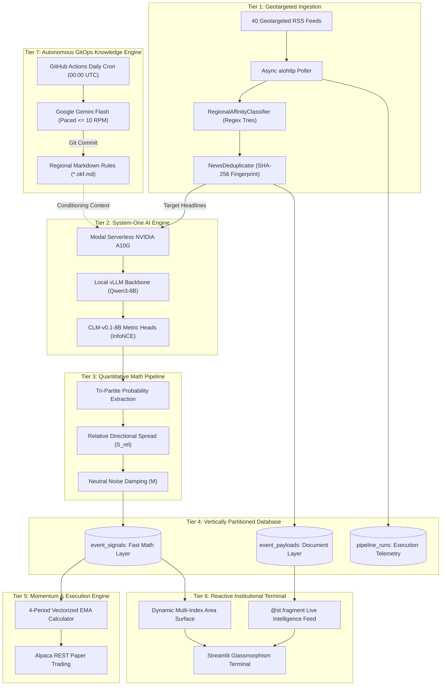

# Valence — Quantitative Macro-Sentiment Platform & Institutional Terminal

<p align="center">
  
</p>

Welcome to the official technical wiki for **Valence** (formerly Global Sentiment Platform of Share Markets / GSP). 

Valence is an autonomous, institutional-grade quantitative macroeconomic sentiment and directional signal engine. It ingests thousands of unstructured global news events in real time across four geopolitical hubs (United States, India, United Kingdom, and Japan), evaluates deterministic market sentiment using **Contrastive Language Models (CLM-8B System-One)**, stores vertically partitioned time-series signals in PostgreSQL, computes multi-period Exponential Moving Average (EMA) momentum indicators, executes automated paper trades via Alpaca's REST API, and renders low-latency telemetry to an institutional Streamlit terminal.

---

## 📑 Table of Contents

1. [Executive Summary & Core Philosophy](#1-executive-summary--core-philosophy)
2. [The System-One Paradigm: Tri-Level Architecture Comparison](#2-the-system-one-paradigm-tri-level-architecture-comparison)
3. [7-Tier Operational Dataflow & Architecture](#3-7-tier-operational-dataflow--architecture)
4. [Quantitative Research & Scoring Mathematics](#4-quantitative-research--scoring-mathematics)
5. [Institutional Terminal Guide (UI Telemetry)](#5-institutional-terminal-guide-ui-telemetry)
6. [Dynamic Objective Knowledge Framework (OKF)](#6-dynamic-objective-knowledge-framework-okf)
7. [Developer Quickstart & Execution Runbook](#7-developer-quickstart--execution-runbook)
8. [Production Operations & Resiliency Matrix](#8-production-operations--resiliency-matrix)

---

## 1. Executive Summary & Core Philosophy

Conventional natural language processing (NLP) pipelines in quantitative finance rely on autoregressive generative Large Language Models (LLMs) such as GPT-4, Claude, or Llama. These models suffer from non-deterministic token sampling entropy, high per-call latency ($2{,}000\text{--}5{,}000\text{ ms}$), formatting hallucinations, and subjective confidence clustering (e.g., arbitrarily clustering around $0.8$ or $0.2$).

**Valence eliminates generative token decoding entirely.** The platform is built upon four foundational pillars:

1. **System-One Metric Embedding Evaluation**: Projects financial text directly into a continuous metric space $\mathbb{S}^{k-1}$, evaluating orthogonal candidate hypotheses with native mathematical probabilities where $P(\text{Bullish}) + P(\text{Bearish}) + P(\text{Neutral}) = 1.0$.
2. **Strict Vertical Database Partitioning**: Decouples high-frequency analytical time-series queries (`event_signals`) from heavy document metadata blobs (`event_payloads`), guaranteeing microsecond database scans.
3. **GitOps-Driven Macroeconomic Reasoning**: Real-world central bank policy regimes mutate constantly. Regional trading heuristics reside in declarative Objective Knowledge Framework (`*.okf.md`) files updated autonomously by scheduled Gemini cron jobs without code redeployments.
4. **Decoupled Serverless Topologies**: Ingestion (GitHub Actions), AI Inference (Modal serverless A10G GPU), Relational Persistence (Supabase PostgreSQL), and Visualization (Streamlit Cloud) scale independently with zero operational lock-in.

---

## 2. The System-One Paradigm: Tri-Level Architecture Comparison

Valence builds upon the contrastive foundation of **TypeSafe AI's Jev** architecture, refining it into a fully normalized, asset-class-aware quantitative sentiment engine.

| Evaluation Dimension | Generative LLMs (Autoregressive) | TypeSafe AI (Vanilla Jev) | Valence CLM System-One Engine |
| :--- | :--- | :--- | :--- |
| **Scoring Mechanism** | Generates text tokens / Prompted JSON | Contrastive representation / Choice probabilities | **Focused Bipolar Simplex + Quantitative Spread ($S_{\text{rel}}$)** |
| **Inference Latency** | $2{,}000\text{--}5{,}000\text{ ms}$ / headline | $300\text{--}600\text{ ms}$ / call (standard hosted API) | **$< 250\text{ ms}$** / headline (dedicated serverless A10G ASGI) |
| **Output Stability** | Prone to formatting errors and hallucinations | Deterministic choice probabilities ($P_i \in [0, 1]$) | **$100\%$ deterministic continuous momentum ($-100$ to $+100$)** |
| **Confidence Calibration** | Qualitative clustering (e.g., $0.8$ vs $0.2$) | Raw probabilities; uncalibrated directional spread | **Calibrated relative directional conviction ($S_{\text{rel}}$)** |
| **Signal Noise Handling** | Neutral sentiment easily misclassified | Prone to neutral flatlining ($P \ge 0.90$) on dense context | **Explicit non-linear neutral attenuation factor ($M$)** |
| **Macro & Asset Conditioning**| Unstructured prompts; prone to attention drift | Static criteria; no dynamic macro regime awareness | **Dynamic regional OKF priors + asset-class-aware criteria** |
| **Execution Integration** | Requires regex parsing & ad-hoc heuristics | Discrete outputs; no native temporal smoothing | **Vectorized 4P EMA recursive filtering & Alpaca paper trading** |

---

## 3. 7-Tier Operational Dataflow & Architecture



### Architectural Breakdown

1. **Geotargeted Ingestion**: Queries 40 RSS channels with exact quoting (`"%22{ticker}%22"`) and regional country editions (`&gl=IN`, `&gl=US`, `&gl=GB`, `&gl=JP`).
2. **Regex Affinity Gatekeeper**: Pre-compiles word-boundary regex trees across index tickers ($3.0\times$), constituent companies ($2.0\times$), and central bank anchors ($1.0\times$), rejecting cross-region contaminants.
3. **Dual Deduplication**: Employs intra-run fingerprinting and 48-hour database lookups to prevent redundant inference calls.
4. **Modal Serverless ASGI**: Hosts the Qwen3-8B embedding backbone and CLM projection heads natively on an NVIDIA A10G GPU, bypassing TCP proxy deadlocks and cold-boot delays.
5. **Vertical Partitioning**: Separates numerical vector fields (`id`, `created_at`, `sentiment_score`, `region_tag`, `index_ticker`) into `event_signals` and stores raw JSON metadata in `event_payloads`.
6. **Execution Engine**: Vectorizes EMA calculation ($\alpha = 0.40$), executing market orders on Alpaca when crossing directional boundaries.
7. **Institutional Terminal**: Renders continuous area plots and `@st.fragment`-isolated news feeds in permanent dark mode (`#020617`).

---

## 4. Quantitative Research & Scoring Mathematics

### Stage 1: Tri-Partite Simplex Projection
The text payload is projected into a $k$-dimensional embedding space and evaluated against orthogonal hypotheses:
$$\mathbf{p} = \begin{bmatrix} P(\text{Bullish}) \\ P(\text{Bearish}) \\ P(\text{Neutral}) \end{bmatrix} \in \Delta^2, \quad \sum_{i} P_i = 1.0$$

### Stage 2: Relative Directional Conviction ($S_{\text{rel}}$)
Isolates directional asymmetry between expansionary and contractionary expectations:
$$S_{\text{rel}} = \frac{P(\text{Bullish}) - P(\text{Bearish})}{P(\text{Bullish}) + P(\text{Bearish}) + \epsilon}$$
*Bounded strictly in $[-1.0, 1.0]$.*

### Stage 3: Conviction & Neutral Attenuation Magnitude ($M$)
Dampens the magnitude of bulletins that carry high neutral probability mass (uninformative baseline noise):
$$M = |S_{\text{rel}}| \times \left(1.0 - 0.5 \times P(\text{Neutral})\right)$$

### Stage 4: Signed Directional Score ($\mathcal{S}_{\text{dir}}$)
Converts raw relative conviction into an institutional momentum score:
$$\mathcal{S}_{\text{dir}} = \operatorname{sgn}(S_{\text{rel}}) \times M \times 100.0 \in [-100.0, +100.0]$$

### Stage 5: Time-Series Exponential Moving Average ($\text{EMA}_\alpha$)
A continuous recursive temporal filter smooths raw headline noise for automated order routing:
$$\text{EMA}_t = \alpha \cdot \bar{I}_t + (1 - \alpha) \cdot \text{EMA}_{t-1}, \quad \alpha = \frac{2}{W + 1}$$
*For default $W = 4$ hours lookback: $\alpha = 0.40$. Memory half-life $t_{1/2} = 1.36$ periods.*

---

## 5. Institutional Terminal Guide (UI Telemetry)

The dashboard (`src/ui/app.py`) is styled permanently in dark mode (`#020617` canvas, `#0f172a` cards, `#10b981` / `#ef4444` directional accents) and organized into seven distinct modules:

```
+------------------------------------------------------------------------------------+
|                       VALENCE - INSTITUTIONAL TERMINAL LAYOUT                      |
+------------------------------------------------------------------------------------+
|  [HEADER BANNER: Valence Identity & Vector SVG (Left) | Pipeline Telemetry (Right)]|
+------------------------------------------------------------------------------------+
|  [USP BANNER: Automated Horizontal Scrolling Ticker Preview (Collapsible Details)] |
+------------------------------------------------------------------------------------+
|  [TOOLBAR: 5 Aligned Dropdowns (Timeframe | Region | Index | Timezone | EMA Window)]|
+------------------------------------------------------------------------------------+
|  [LEFT COLUMN: 4 Stacked KPI Cards]   |  [RIGHT COLUMN: Multi-Index Area Surface]  |
|  - Aggregate Optimism (% + Vector)    |  - Plotly Dynamic Time-Series Chart        |
|  - Market Bias (Bull/Bear/Neut)       |  - Color-Coded Translucent Fills           |
|  - Total News Volume (Count)          |  - Thick Regional EMA Trend Line           |
|  - Tracked Indices (Coverage)         |  - Embedded Mini-Index KPI Tiles Grid      |
+------------------------------------------------------------------------------------+
|  [SECTION: Dynamic Fragment-Isolated Live Intelligence Feed (@st.fragment)]         |
|  - Filter Pills: [ALL] [BULLISH] [BEARISH] [NEUTRAL]                               |
|  - Responsive News Cards with Directional Badges, Canonical Fingerprints & Links   |
+------------------------------------------------------------------------------------+
```

### Key UI Features
- **Pulsating Brand Beacon**: Live CSS-animated green beacon indicating active operational status.
- **Pipeline Completion Freshness Badge**: Tracks actual ingestion run completion time (`UPDATED HH:MM IST (Xm ago)`) rather than superficial page reloads.
- **Dynamic Timezone Normalization**: Automatically converts all timestamps across UTC, IST (Kolkata), EST (New York), GMT (London), and JST (Tokyo).
- **Partial Fragment Reactivity (`@st.fragment`)**: Filtering feed items by sentiment pill updates only the feed container, preventing expensive chart redraws or database reconnects.

---

## 6. Dynamic Objective Knowledge Framework (OKF)

Macroeconomic policies mutate dynamically across central banks (Federal Reserve, RBI, Bank of England, Bank of Japan). Valence maintains real-time policy rules in version-controlled markdown documents:

- `knowledge/us_macro.okf.md` — Federal Reserve rates, US CPI, Treasury yields, Dollar index dynamics.
- `knowledge/india_macro.okf.md` — RBI repo rates, domestic liquidity, food/fuel inflation, monsoon impact.
- `knowledge/uk_macro.okf.md` — Bank of England stance, Gilt yields, Sterling exchange rates, FTSE trends.
- `knowledge/japan_macro.okf.md` — BoJ Yield Curve Control (YCC), negative rate exits, Yen carry trades.

### Autonomous Updater (`src/knowledge_engine/okf_updater.py`)
- Runs daily at `00:00 UTC` via GitHub Actions (`.github/workflows/update_okf.yml`).
- Scrapes central bank speeches and macro releases, prompting Google Gemini to detect regime shifts.
- Implements dynamic model discovery (`client.models.list()`) with automatic fallback (`gemini-3.8-flash` $\to$ `gemini-3.7-flash` $\to$ `gemini-2.0-flash`).
- Strict rate pacing (`MIN_REQUEST_INTERVAL = 6.0s`) prevents free-tier API quota exhaustion.
- Pushes verified rule updates back to `master` via automated Git bot commits.

---

## 7. Developer Quickstart & Execution Runbook

### Environment Setup
Clone the repository and install required dependencies:
```bash
git clone https://github.com/Shivam-Jha96/gsp.git
cd gsp
python -m venv .venv
source .venv/bin/activate  # On Windows: .venv\Scripts\activate
pip install -r requirements.txt
```

### Configuration (`.env`)
Create a `.env` file in the project root:
```env
# Database (Supabase PostgreSQL)
DATABASE_URL="postgresql://postgres:[PASSWORD]@[HOST]:6543/postgres"

# AI Inference (Modal / TypeSafe)
TYPESAFE_API_KEY="your-typesafe-modal-key"

# Knowledge Engine (Google Gemini)
GEMINI_API_KEY="your-gemini-api-key"

# Execution Engine (Alpaca Paper Trading)
ALPACA_API_KEY="your-alpaca-key"
ALPACA_SECRET_KEY="your-alpaca-secret"
```

### Running Locally
1. **Execute Ingestion & Scoring Pipeline**:
   ```bash
   python src/main.py
   ```
2. **Launch Institutional Dashboard**:
   ```bash
   streamlit run src/ui/app.py
   ```
3. **Execute Database Maintenance & Cleanup**:
   ```bash
   python scripts/reclassify_database.py --mode=dry-run
   python scripts/reclassify_database.py --mode=purge
   ```
4. **Run Unit Test Suite**:
   ```bash
   python -m unittest discover -s tests/unit
   ```

---

## 8. Production Operations & Resiliency Matrix

| Service / Layer | Provider | SLA | Failure Mode | Auto-Recovery Mechanism |
| :--- | :--- | :--- | :--- | :--- |
| **CLM Inference** | Modal Labs (A10G) | 99.9% | Cold-boot latency / Container timeout | ASGI mount bypasses proxy; graceful fallback to Neutral ($0.0$) score on timeout. |
| **Relational DB** | Supabase (AWS) | 99.95% | PgBouncer pooler idle connection drop | ThreadedConnectionPool with pre-checkout `_is_alive()` ping; transparent 2-attempt UI retry loop. |
| **Knowledge Cron** | Google GenAI | 99.9% | HTTP 429 Quota or HTTP 503 Overload | Paced requests ($\ge 6.0\text{s}$ interval); immediate failover to secondary Flash models. |
| **Ingestion** | GitHub Actions | 99.9% | Network timeout on regional RSS feed | Async aiohttp timeout guards (10s); continues processing healthy feeds. |
| **Trade Execution**| Alpaca API | 99.95% | Order reject on outside-hours trading | Paper trading orders automatically queued or logged without blocking pipeline. |

---

*Valence Wiki • Document Version 2.5.0 • Maintained by Quantitative Research & Engineering*
